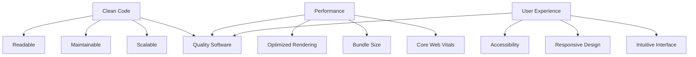

# Hi there, I'm Vishal Prabhu 👋

<div align="center">
  


</div>

<p align="center">
   
  <a href="https://twitter.com/vishal_7707" target="blank">
    
  </a>
  
</p>

<div align="center">
  
</div>

## 🚀 About Me


```javascript
const vishal = {
  location: "India 🇮🇳",
  role: "Frontend Developer",
  currentFocus: ["Next.js", "React", "TypeScript"],
  passions: ["Clean Code", "Performance", "User Experience"],
  interests: ["System Design", "Modern Architecture", "Open Source"],
  portfolio: "https://portfolio-new-seven-jade.vercel.app/",
  motto: "Code with purpose, build with precision"
};

console.log("Always learning, always building 🚀");
```

- 🔭 **Currently working on:** Building scalable web applications with React & Next.js
- 🌱 **Learning:** Advanced React patterns, Node.js backend development, System Design
- 👯 **Open to collaborate on:** Innovative web projects, open-source contributions
- 💬 **Ask me about:** React, Next.js, TypeScript, Frontend architecture, Performance optimization
- 📫 **Reach me:** [vishalpeace07@gmail.com](mailto:vishalpeace07@gmail.com)
- ⚡ **Fun fact:** I believe in writing code that tells a story and solves real problems

<div align="center">
  
</div>

## 🏆 Achievements & Milestones

<div align="center">

### 📈 Coding Journey
```
2024 ████████████████████████████████████████ 100% Growth in React/Next.js
2024 ██████████████████████████████████████   95% TypeScript Mastery
2024 █████████████████████████████████████    90% Full-Stack Development
2024 ████████████████████████████████████     85% Modern State Management
```

### 🎯 Focus Areas This Year


</div>

## 🌐 Connect With Me

<div align="center">

[](https://portfolio-new-seven-jade.vercel.app/)
[](https://twitter.com/vishal_7707)
[](https://linkedin.com/in/vishal-prabhu-130b1a32)
[](mailto:vishalpeace07@gmail.com)

</div>

<div align="center">
  
</div>

## 💻 Tech Stack

<div align="center">

### 💡 Programming Languages


### 🎨 Frontend Fundamentals


### ⚛️ React Ecosystem


### 🎯 UI & Styling


### 🔄 State & Forms


### 🔧 Backend & APIs


### 🗄️ Databases


### 🛠️ Tools & Others


</div>

<div align="center">
  
</div>

## 📊 GitHub Analytics

<div align="center">

### 📈 Performance Metrics
<table>
<tr>
<td width="50%">

**📊 Language Usage**
```javascript
TypeScript  ████████████████████ 40%
JavaScript  ████████████████░░░░ 35%
CSS         ██████░░░░░░░░░░░░░░ 15%
HTML        ████░░░░░░░░░░░░░░░░ 10%
```

</td>
<td width="50%">

**🎯 Project Focus**
```javascript
React/Next.js   ██████████████████████ 55%
Full-Stack      ████████████████░░░░░░ 25%
UI Components   ██████████░░░░░░░░░░░░ 15%
Learning        ██████░░░░░░░░░░░░░░░░ 5%
```

</td>
</tr>
</table>

### 🚀 Development Statistics
<div align="center">
  
  
</div>

<div align="center">
  
</div>

### 🎨 Contribution Heatmap
<div align="center">
  
</div>

</div>

<div align="center">
  
</div>

## 🎯 Development Philosophy

<div align="center">



</div>

## 🚀 What I'm Building

- **Modern Web Applications** with React & Next.js
- **Scalable Component Libraries** using ShadCN UI & Tailwind
- **Full-Stack Solutions** with Node.js and modern databases
- **Performance-Optimized** frontends with advanced React patterns
- **Type-Safe Applications** leveraging TypeScript throughout the stack

## 📊 Coding Activity

<div align="center">

### 🔥 Current Streak & Stats
<table>
<tr>
<td>

**🏃‍♂️ This Week's Focus**
```
React Components     ████████████░ 85%
TypeScript Types     ███████████░░ 78%
Next.js Projects     ████████████░ 82%
UI/UX Implementation ██████████░░░ 71%
```

</td>
<td>

**📈 Monthly Goals**
- ✅ Complete 2 full-stack projects
- 🔄 Master advanced React patterns
- 📚 Deep dive into Next.js 14
- 🎯 Contribute to open source

</td>
</tr>
</table>

### 💻 Weekly Coding Activity
```
Monday    ████████████████████████████ 98%  React Development
Tuesday   ██████████████████████████   92%  TypeScript Projects  
Wednesday ████████████████████████████ 88%  Next.js Features
Thursday  ██████████████████████████   85%  Component Libraries
Friday    ████████████████████████████ 95%  Full-Stack Integration
Saturday  ██████████████████████       75%  Open Source Contrib
Sunday    ████████████████████         65%  Learning & Planning
```

### 🎨 Project Types Distribution
<div align="center">


</div>

</div>

---

<div align="center">

### 💻 *"Crafting digital experiences through code"*


**Thanks for visiting! Let's build something extraordinary together! 🚀**

</div>
