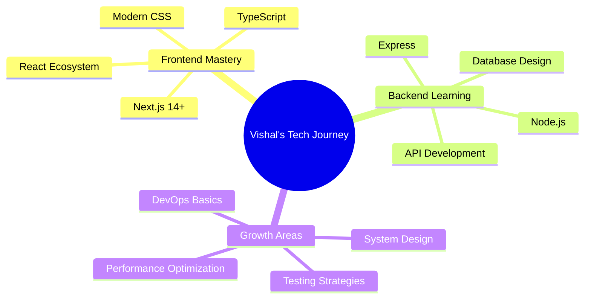

# Hi there, I'm Vishal Prabhu 👋

<div align="center">
  


</div>

<p align="center">
   
  <a href="https://twitter.com/vishal_7707" target="blank">
    
  </a>
  
</p>

<div align="center">
  
</div>

## 🚀 About Me


```javascript
const vishal = {
  location: "India 🇮🇳",
  role: "Frontend Developer",
  currentFocus: ["Next.js", "Node.js", "TypeScript"],
  passions: ["Clean Code", "UI/UX", "Open Source"],
  hobbies: ["Hackathons", "Tech Blogs", "Coffee ☕"],
  motto: "Code is poetry written in logic"
};

console.log(vishal.toString());
```

- 🔭 **Currently working on:** Building scalable web applications with React & Next.js
- 🌱 **Learning:** Advanced Next.js patterns, Node.js backend development
- 👯 **Open to collaborate on:** Innovative web projects, open-source contributions
- 💬 **Ask me about:** React, JavaScript, Frontend architecture, UI/UX
- 📫 **Reach me:** [vishalpeace07@gmail.com](mailto:vishalpeace07@gmail.com)
- ⚡ **Fun fact:** I debug with console.log and I'm not ashamed! 😄

<div align="center">
  
</div>

## 🏆 GitHub Trophies

<div align="center">
  
</div>

## 🌐 Connect With Me

<div align="center">

[](https://twitter.com/vishal_7707)
[](https://linkedin.com/in/vishal-prabhu-130b1a32)
[](https://instagram.com/lazer_7707)
[](mailto:vishalpeace07@gmail.com)

</div>

<div align="center">
  
</div>

## 💻 Tech Stack

<div align="center">

### 🎨 Frontend Development


### 🎯 Styling & UI


### ⚙️ State Management & Tools


### 🔧 Backend & Database


### 🛠️ Development Tools


### 💻 Programming Languages


</div>

<div align="center">
  
</div>

## 📊 GitHub Analytics

<div align="center">
  
  
</div>

<div align="center">
  
</div>

<div align="center">
  
</div>

<div align="center">
  
</div>

## 🎯 Current Focus

<div align="center">



</div>

## 📈 Contribution Graph

<div align="center">
  
</div>

---

<div align="center">

### 💫 *"Building the web, one component at a time"*


**Thanks for visiting! Let's connect and build something amazing together! 🚀**

</div>
