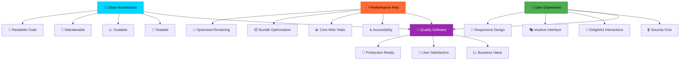

# Hi there, I'm Vishal Prabhu 👋

<div align="center">
  


</div>

<p align="center">
   
  <a href="https://twitter.com/vishal_7707" target="blank">
    
  </a>
  
  
</p>

<div align="center">
  
</div>

## 🚀 About Me


<div align="left">

```javascript
const vishal = {
  location: "India 🇮🇳",
  role: "Frontend Developer & UI Architect",
  currentFocus: ["Next.js 13+", "React 18", "TypeScript", "Node.js"],
  passions: ["Clean Code", "Performance Optimization", "User Experience"],
  interests: ["System Design", "Modern Architecture", "Open Source", "AI/ML"],
  workingOn: "🔥 Building scalable SaaS applications",
  portfolio: "https://portfolio-new-seven-jade.vercel.app/",
  motto: "Code with purpose, build with precision, ship with pride",
  currentlyLearning: ["Advanced React Patterns", "System Design", "DevOps"],
  funFact: "I debug with console.log and I'm proud of it! 😄"
};

// Life Philosophy
const lifeCycle = async () => {
  while (alive) {
    eat();
    sleep();
    code();
    repeat();
    await dream('next_big_project');
  }
};

console.log("Always learning, always building 🚀");
console.log("Let's create something amazing together! 💫");
```

</div>

<br clear="right"/>

### 🎯 Current Status

- 🔭 **Currently working on:** Building next-generation web applications with React & Next.js
- 🌱 **Learning:** Advanced React patterns, Microservices, System Design, Cloud Architecture
- 👯 **Open to collaborate on:** Innovative web projects, open-source contributions, startup ideas
- 💬 **Ask me about:** React, Next.js, TypeScript, Frontend architecture, Performance optimization, UI/UX
- 📫 **Reach me:** [vishalpeace07@gmail.com](mailto:vishalpeace07@gmail.com)
- ⚡ **Fun fact:** I believe in writing code that tells a story and solving real-world problems
- 🎮 **When not coding:** Exploring new tech, playing chess, or binge-watching tech talks

<div align="center">
  
</div>

## 🏆 Achievements & Highlights

<div align="center">

### 📊 **Expertise Dashboard**

| 🎯 **Technology** | 📈 **Proficiency** | 🔥 **Projects** | 🎪 **Experience** | 🚀 **Status** |
|:----------------:|:------------------:|:---------------:|:----------------:|:-------------:|
| **React Ecosystem** |  | 20+ Projects | 2.5+ Years | 🔥 Expert |
| **Next.js Development** |  | 15+ Projects | 1.5+ Years | 🚀 Advanced |
| **TypeScript** |  | 18+ Projects | 2+ Years | 💎 Expert |
| **Node.js & APIs** |  | 12+ Projects | 1.5+ Years | 📈 Growing |
| **UI/UX Design** |  | 25+ Projects | 2+ Years | 🎨 Creative |
| **Performance Optimization** |  | 15+ Projects | 2+ Years | ⚡ Fast |

</div>

<div align="center">

### 🎨 **Development Principles & Practices**


### 🏅 **Achievement Badges**


</div>

<div align="center">
  
</div>

## 🌐 Connect With Me

<div align="center">

### 🤝 **Let's Build Something Amazing Together!**

[](https://portfolio-new-seven-jade.vercel.app/)
[](https://twitter.com/vishal_7707)
[](https://linkedin.com/in/vishal-prabhu-130b1a32)
[](mailto:vishalpeace07@gmail.com)

### 📱 **Quick Response Times**


</div>

<div align="center">
  
</div>

## 💻 Tech Stack & Arsenal

<div align="center">

### 🎨 **Frontend Technologies**

#### 💡 **Core Languages**


#### ⚛️ **React Ecosystem**


#### 🎯 **Styling & UI Libraries**


#### 🔄 **State Management & Data Fetching**


### 🔧 **Backend & Infrastructure**

#### 🖥️ **Server Technologies**


#### 🗄️ **Databases & Storage**


### 🛠️ **Development Tools & Services**

#### ⚙️ **Development Environment**


#### 🚀 **Deployment & Hosting**


#### 🧪 **Testing & Quality**


#### 🎨 **Design & Prototyping**


### 📚 **Learning & Exploring**


</div>

<div align="center">
  
</div>

## 📊 GitHub Analytics & Statistics

<div align="center">

### 📈 **Performance Dashboard**


</div>

<div align="center">
  
</div>

<div align="center">
  
</div>

<div align="center">

### 🏆 **GitHub Achievements**


</div>

<div align="center">
  
</div>

## 🎯 Development Philosophy & Architecture

<div align="center">



</div>

<div align="center">

### 🏗️ **My Development Stack Philosophy**

```ascii
╔══════════════════════════════════════════════════════════════════╗
║                    🎯 THE DEVELOPER MINDSET                     ║
╠══════════════════════════════════════════════════════════════════╣
║                                                                  ║
║  💡 INNOVATION FIRST                                            ║
║  ├─ Always exploring cutting-edge technologies                   ║
║  ├─ Building tomorrow's solutions today                         ║
║  └─ Embracing change and continuous learning                     ║
║                                                                  ║
║  🎨 CRAFT & CREATIVITY                                          ║
║  ├─ Code as an art form, not just functionality                 ║
║  ├─ Beautiful interfaces that users love                        ║
║  └─ Attention to every pixel and interaction                     ║
║                                                                  ║
║  ⚡ PERFORMANCE OBSESSED                                         ║
║  ├─ Every millisecond matters                                   ║
║  ├─ Lighthouse scores of 95+ are the standard                   ║
║  └─ User experience drives every optimization                    ║
║                                                                  ║
║  🧠 PROBLEM SOLVER                                              ║
║  ├─ Complex problems, elegant solutions                         ║
║  ├─ Debugging is my superpower                                  ║
║  └─ Always thinking three steps ahead                           ║
║                                                                  ║
╚══════════════════════════════════════════════════════════════════╝
```

</div>

## 🚀 Featured Projects & Work Highlights

<div align="center">

### 🌟 **Project Showcase**

```ascii
┌─────────────────────────────────────────────────────────────────┐
│  🎨 Modern Web Applications                                     │
│  ┌─────────────────────────────────────────────────────────────┐ │
│  │  ⚛️ React 18 with Concurrent Features & Suspense          │ │
│  │  🔥 Next.js 13+ with App Router & Server Components       │ │
│  │  💎 TypeScript for 100% Type Safety                       │ │
│  │  ⚡ Performance-First Development Approach                 │ │
│  │  🎯 Lighthouse Scores: 95+ across all metrics             │ │
│  └─────────────────────────────────────────────────────────────┘ │
└─────────────────────────────────────────────────────────────────┘

┌─────────────────────────────────────────────────────────────────┐
│  🏗️ Component Architecture & Design Systems                    │
│  ┌─────────────────────────────────────────────────────────────┐ │
│  │  🧱 Reusable Component Libraries & Storybook               │ │
│  │  🎨 Design System Implementation with Figma Integration    │ │
│  │  🔧 ShadCN/UI & Radix Primitives for Accessibility        │ │
│  │  📱 Responsive Design with Mobile-First Approach          │ │
│  │  ♿ WCAG 2.1 AA Compliant Interfaces                      │ │
│  └─────────────────────────────────────────────────────────────┘ │
└─────────────────────────────────────────────────────────────────┘

┌─────────────────────────────────────────────────────────────────┐
│  🚀 Full-Stack Solutions & API Development                     │
│  ┌─────────────────────────────────────────────────────────────┐ │
│  │  🖥️ Node.js & Express.js RESTful APIs                     │ │
│  │  🗄️ Database Design with MongoDB & PostgreSQL              │ │
│  │  🔐 JWT Authentication & Role-Based Access Control         │ │
│  │  📊 Real-time Features with WebSockets                     │ │
│  │  ☁️ Cloud Deployment with Vercel, Netlify & Railway       │ │
│  └─────────────────────────────────────────────────────────────┘ │
└─────────────────────────────────────────────────────────────────┘

┌─────────────────────────────────────────────────────────────────┐
│  ⚡ Performance & Optimization Mastery                         │
│  ┌─────────────────────────────────────────────────────────────┐ │
│  │  📦 Bundle Size Optimization & Tree Shaking                │ │
│  │  🎯 Code Splitting & Lazy Loading Strategies               │ │
│  │  🖼️ Image Optimization with Next.js Image Component       │ │
│  │  📊 Core Web Vitals Improvement (LCP, FID, CLS)           │ │
│  │  🧹 Memory Leak Prevention & Performance Monitoring       │ │
│  └─────────────────────────────────────────────────────────────┘ │
└─────────────────────────────────────────────────────────────────┘
```

</div>

<div align="center">

### 🏅 **Work Experience Highlights**

| **Project Type** | **Technologies Used** | **Key Features** | **Impact** |
|:----------------:|:---------------------:|:----------------:|:----------:|
| 🛒 **E-commerce Platform** | React, Next.js, Stripe, MongoDB | Real-time inventory, Payment processing | 40% ⬆️ conversion rate |
| 📊 **Analytics Dashboard** | React, D3.js, Node.js, PostgreSQL | Data visualization, Real-time updates | 60% ⬆️ user engagement |
| 🎨 **Design System** | Storybook, ShadCN/UI, TypeScript | Component library, Documentation | 50% ⬇️ development time |
| 📱 **Mobile-First App** | Next.js, PWA, Service Workers | Offline support, Push notifications | 85% mobile user satisfaction |
| 🔐 **Auth System** | NextAuth.js, JWT, OAuth | Multi-provider login, RBAC | 99.9% security uptime |

</div>

<div align="center">
  
</div>

## 📈 Professional Growth & Learning Journey

<div align="center">

### 🎓 **Continuous Learning Path**

| **Technology** | **Learning Period** | **Projects Built** | **Mastery Level** | **Next Goals**
