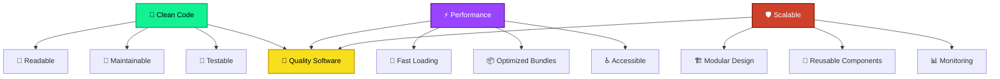

#   Vishal Prabhu 

```ascii
                ██╗   ██╗██╗███████╗██╗  ██╗ █████╗ ██╗         ██████╗ ██████╗  █████╗ ██████╗ ██╗  ██╗██╗   ██╗
                ██║   ██║██║██╔════╝██║  ██║██╔══██╗██║         ██╔══██╗██╔══██╗██╔══██╗██╔══██╗██║  ██║██║   ██║
                ██║   ██║██║███████╗███████║███████║██║         ██████╔╝██████╔╝███████║██████╔╝███████║██║   ██║
                ╚██╗ ██╔╝██║╚════██║██╔══██║██╔══██║██║         ██╔═══╝ ██╔══██╗██╔══██║██╔══██╗██╔══██║██║   ██║
                 ╚████╔╝ ██║███████║██║  ██║██║  ██║███████╗    ██║     ██║  ██║██║  ██║██████╔╝██║  ██║╚██████╔╝
                  ╚═══╝  ╚═╝╚══════╝╚═╝  ╚═╝╚═╝  ╚═╝╚══════╝    ╚═╝     ╚═╝  ╚═╝╚═╝  ╚═╝╚═════╝ ╚═╝  ╚═╝ ╚═════╝ 
```

<div align="center">

[](https://git.io/typing-svg)


</div>

---

## 🧑‍💻 whoami

```bash
$ cat /dev/vishal.json
```

```json
{
  "name": "Vishal Prabhu",
  "location": "Chennai, India 🇮🇳",
  "role": "Fullstack Developer & Web3 Builder",
  "current_status": "Shipping scalable web apps & going deep on Rust + Solana",
  "code_editor": "VS Code",
  "favorite_language": "TypeScript (but Rust is calling)",
  "currently_working_on": [
    "⚡  Scalable fullstack apps with Next.js + Nest.js",
    "🦀  Rust — ownership, lifetimes, async",
    "☀️  Solana — learning on-chain programs",
    "🔁  Exploring crypto & DeFi primitives"
  ],
  "learning": [
    "Rust → systems programming + Solana programs",
    "Solana → Anchor, PDAs, SPL tokens",
    "Crypto/DeFi → protocols, tokenomics, cross-chain"
  ],
  "motto": "Write code that doesn't just work, but tells a story"
}
```

---

## 🛠️ Tech Arsenal

<details>
<summary>🎯 <strong>Full Stack</strong> (click to expand)</summary>

```yaml
languages:
  fluent:   ["TypeScript", "JavaScript", "Java", "C", "C++", "Python"]
  learning: ["Rust", "Solidity"]

frontend:
  frameworks: ["React.js", "Next.js", "Electron.js", "Tauri"]
  styling:    ["Tailwind CSS"]

backend:
  runtime:    ["Node.js"]
  frameworks: ["Nest.js", "Express.js"]
  databases:  ["PostgreSQL", "MongoDB"]
  orm:        ["Drizzle ORM", "Mongoose"]
  apis:       ["REST", "GraphQL", "WebSockets"]

tools:
  devops: ["Git", "Docker", "AWS", "Vercel", "CI/CD"]
  other:  ["SEO", "GraphQL", "WebSockets"]

learning:
  - "Rust — ownership, traits, async/await"
  - "Solana — on-chain programs, Anchor"
  - "Crypto/DeFi — protocols & tokenomics"
```

</details>

<div align="center">

### 💻 Languages


### ⚙️ Frameworks & Runtimes


### 🗄️ Databases & ORM


### ⚙️ Tools & Infra


</div>

---

## 📊 GitHub Analytics

<div align="center">


</div>

---

## 🏗️ How I Think About Software


```mermaid
graph TB
    A[🎯 Clean Code] --> B[📖 Readable]
    A --> C[🔧 Maintainable]
    A --> D[🧪 Testable]

    E[⚡ Performance] --> F[🚀 Fast Loading]
    E --> G[📦 Optimized Bundles]
    E --> H[♿ Accessible]

    I[🛡️ Scalable] --> J[🏗️ Modular Design]
    I --> K[🔄 Reusable Components]
    I --> L[📊 Monitoring]

    A --> M[💎 Quality Software]
    E --> M
    I --> M

    style A fill:#14F195,stroke:#0aab66,stroke-width:2px,color:#000
    style E fill:#9945FF,stroke:#6a1b9a,stroke-width:2px,color:#fff
    style I fill:#CE422B,stroke:#8b1a0a,stroke-width:2px,color:#fff
    style M fill:#F7DF1E,stroke:#c4a000,stroke-width:2px,color:#000
```

---

## 🎯 Current Focus

<table>
<tr>
<td valign="top" width="33%">

**🦀 Rust + Solana**
- Ownership & borrow checker
- Async Rust patterns
- Solana on-chain programs
- Anchor framework & PDAs

</td>
<td valign="top" width="33%">

**🔁 Crypto / DeFi**
- AMM mechanics
- DeFi protocol design
- Tokenomics & cross-chain
- Privacy-preserving primitives

</td>
<td valign="top" width="33%">

**🏗️ Fullstack Architecture**
- Scalable Next.js + Nest.js
- Drizzle ORM + Postgres
- Desktop apps w/ Electron/Tauri
- WebSocket real-time systems

</td>
</tr>
</table>

---

## 📈 Coding Activity

```bash
$ git log --oneline --graph --decorate --all
```

<div align="center">

[](https://github.com/ashutosh00710/github-readme-activity-graph)

</div>

---

## 🌐 Connect

<div align="center">

[](https://vishaldev.space/)
[](https://twitter.com/vishal_7707)
[](https://www.linkedin.com/in/vishal-prabhu-130b1a323/)
[](mailto:vishalpeace07@gmail.com)

</div>

---

```typescript
const vishal = {
  code:       ["TypeScript", "JavaScript", "Python", "Rust*"],
  frameworks: ["Next.js", "React", "Nest.js", "Electron", "Tauri"],
  databases:  ["PostgreSQL", "MongoDB", "Drizzle ORM"],
  tools:      ["Docker", "AWS", "Vercel", "Git", "GraphQL", "WebSockets"],
  learning:   ["Rust", "Solana", "Crypto/DeFi"],
  askMeAbout: ["Next.js", "Node.js", "TypeScript", "fullstack architecture"],
  funFact:    "I debug faster with console.log than with debuggers 🚀",
};
// * = actively going deep
```

<div align="center">

**💬 `"Write code that doesn't just work, but tells a story."`**

*⭐ From [vishal-770](https://github.com/vishal-770)*

</div>
