# 👨‍💻 Vishal Prabhu

```ascii
    ██╗   ██╗██╗███████╗██╗  ██╗ █████╗ ██╗         ██████╗ ██████╗  █████╗ ██████╗ ██╗  ██╗██╗   ██╗
    ██║   ██║██║██╔════╝██║  ██║██╔══██╗██║         ██╔══██╗██╔══██╗██╔══██╗██╔══██╗██║  ██║██║   ██║
    ██║   ██║██║███████╗███████║███████║██║         ██████╔╝██████╔╝███████║██████╔╝███████║██║   ██║
    ╚██╗ ██╔╝██║╚════██║██╔══██║██╔══██║██║         ██╔═══╝ ██╔══██╗██╔══██║██╔══██╗██╔══██║██║   ██║
     ╚████╔╝ ██║███████║██║  ██║██║  ██║███████╗    ██║     ██║  ██║██║  ██║██████╔╝██║  ██║╚██████╔╝
      ╚═══╝  ╚═╝╚══════╝╚═╝  ╚═╝╚═╝  ╚═╝╚══════╝    ╚═╝     ╚═╝  ╚═╝╚═╝  ╚═╝╚═════╝ ╚═╝  ╚═╝ ╚═════╝ 
                                    ⛓️ BLOCKCHAIN ENGINEER ⛓️
```

<div align="center">

[](https://git.io/typing-svg)


</div>

## 🧑‍💻 $ whoami

```bash
$ curl -s https://api.github.com/users/vishal-770 | jq '.bio'
```

```json
{
  "name": "Vishal Prabhu",
  "location": "India 🇮🇳",
  "role": "Full Stack & Blockchain Developer",
  "specialization": "Web2 → Web3 Bridge Builder",
  "current_status": "Crafting the decentralized future",
  "editor": "VS Code + Vim keybindings (because why choose?)",
  "favorite_stack": "TypeScript + React + Solidity",
  "architecture_philosophy": "Clean, Decentralized, Unstoppable",
  "development_approach": ["DDD", "TDD", "Clean Architecture", "SOLID", "DeFi Patterns"],
  "currently_shipping": [
    "🌐 Full-stack DApps with Next.js + Ethereum",
    "⛓️ Smart contracts with advanced Solidity patterns",
    "🏗️ Scalable component architectures for Web3",
    "⚡ Gas-optimized contracts & frontend performance",
    "🎨 Web3 UI/UX that doesn't suck"
  ],
  "learning_frontier": [
    "🔥 Advanced DeFi protocols & MEV strategies",
    "🔐 Zero-knowledge proofs & privacy tech",
    "🌊 Layer 2 solutions & cross-chain bridges",
    "🤖 AI-powered smart contract analysis",
    "⚡ Rust for blockchain development"
  ],
  "debug_life": ["console.log() at 3 AM", "Gas optimization rabbit holes", "ABI encoding mysteries"],
  "superpowers": ["Can spot reentrancy attacks from orbit", "Debugging reverted transactions", "Making DeFi accessible"],
  "web3_motto": "Code is law, but good UX is religion",
  "life_philosophy": "Build tools that empower, not just impress"
}
```

## ⛓️ Web3 Tech Stack

<div align="center">

### 🚀 Blockchain & Smart Contracts


### 🌐 Web3 Frontend


### 💻 Core Technologies


### 🛠️ Development Arsenal


</div>

<details>
<summary>🎯 <strong>Complete Tech Arsenal</strong> (Click to expand)</summary>

```yaml
blockchain:
  smart_contracts: ["Solidity", "Vyper (learning)", "Assembly (EVM)"]
  frameworks: ["Hardhat", "Foundry", "Truffle", "Remix"]
  libraries: ["OpenZeppelin", "Chainlink", "Uniswap SDK"]
  testing: ["Foundry Tests", "Hardhat Tests", "Echidna Fuzzing"]
  
web3_frontend:
  wallet_integration: ["MetaMask", "WalletConnect", "Coinbase Wallet"]
  web3_libs: ["ethers.js", "web3.js", "viem"]
  react_web3: ["wagmi", "RainbowKit", "Web3Modal", "ConnectKit"]
  
defi_protocols:
  dexes: ["Uniswap V2/V3", "SushiSwap", "1inch"]
  lending: ["Aave", "Compound", "MakerDAO concepts"]
  yield: ["Yearn", "Convex", "Curve understanding"]
  
frontend_mastery:
  frameworks: ["React 18", "Next.js 14", "Svelte (exploring)"]
  styling: ["Tailwind CSS", "Styled Components", "CSS Modules", "Framer Motion"]
  ui_components: ["shadcn/ui", "Radix UI", "Headless UI", "Chakra UI"]
  state: ["Zustand", "Redux Toolkit", "TanStack Query", "SWR"]
  
backend:
  runtime: ["Node.js", "Deno", "Bun (exploring)"]
  frameworks: ["Express.js", "Fastify", "tRPC", "GraphQL"]
  databases: ["MongoDB", "PostgreSQL", "Supabase", "IPFS"]
  
infrastructure:
  deployment: ["Vercel", "Railway", "Fly.io", "AWS", "Docker"]
  web3_infra: ["Alchemy", "Infura", "QuickNode", "The Graph"]
  monitoring: ["Tenderly", "Defender", "Etherscan APIs"]
```

</details>

## 📊 GitHub Analytics & Contribution Stats

<div align="center">


[](https://github.com/vishal-770)

</div>

## 🏗️ Web3 Architecture Philosophy

```mermaid
graph TB
    subgraph "🌐 Frontend Layer"
        A[⚛️ React/Next.js] --> B[🎨 Tailwind UI]
        A --> C[🔗 Web3 Connectors]
        C --> D[📱 Wallet Integration]
    end
    
    subgraph "⛓️ Blockchain Layer"
        E[📜 Smart Contracts] --> F[🔐 Security Patterns]
        E --> G[⛽ Gas Optimization]
        E --> H[🧪 Comprehensive Testing]
    end
    
    subgraph "🛠️ DevOps & Tools"
        I[🔨 Hardhat/Foundry] --> J[📊 Contract Analytics]
        I --> K[🚀 CI/CD Pipelines]
        I --> L[📈 Performance Monitoring]
    end
    
    A --> E
    E --> I
    
    style A fill:#61dafb,stroke:#21568b,stroke-width:2px,color:#000
    style E fill:#363636,stroke:#000,stroke-width:2px,color:#fff
    style I fill:#f7df1e,stroke:#d4ac0d,stroke-width:2px,color:#000
```



## 🚀 What I'm Building in Web3

```typescript
interface CurrentWeb3Projects {
  dapps: {
    "defi-dashboard": {
      stack: ["Next.js 14", "TypeScript", "wagmi", "Solidity"];
      status: "🚧 Active Development";
      features: ["Multi-DEX aggregation", "Portfolio tracking", "Yield farming"];
      testnet: "Sepolia & Polygon Mumbai";
    };
    
    "nft-marketplace": {
      stack: ["React", "ethers.js", "IPFS", "OpenZeppelin"];
      status: "🎨 UI Polish Phase";
      description: "Gas-efficient NFT marketplace with lazy minting";
      chains: ["Ethereum", "Polygon"];
    };
  };
  
  smart_contracts: {
    "yield-vault": {
      language: "Solidity ^0.8.20";
      patterns: ["Proxy", "AccessControl", "ReentrancyGuard"];
      status: "🔐 Security Audit Ready";
      gas_optimizations: "~30% reduction vs standard implementations";
    };
    
    "dao-governance": {
      features: ["Timelock", "Delegation", "Proposal execution"];
      testing: "100% coverage with Foundry";
      status: "📋 Documentation Phase";
    };
  };
  
  learning_projects: {
    "mev-bot": "🤖 MEV strategies & flashloan arbitrage",
    "zk-proofs": "🔐 Learning Circom & zk-SNARKs",
    "layer2": "🌊 Optimism & Arbitrum integration patterns"
  };
  
  contributions: {
    "web3-ui-kit": "🎨 Reusable Web3 React components",
    "contract-templates": "📜 Audited Solidity templates",
    "tutorials": "✍️ Web2 to Web3 developer guides"
  };
}
```

## 🎯 Development Focus Areas

<table>
<tr>
<td valign="top" width="33%">

**⛓️ Smart Contract Mastery**
- Advanced Solidity patterns
- Gas optimization techniques
- Security-first development
- Comprehensive testing strategies
- DeFi protocol integration

</td>
<td valign="top" width="33%">

**🌐 DApp Development**
- Web3 wallet integration
- Transaction UX optimization
- Real-time blockchain data
- Mobile-responsive Web3 UIs
- Cross-chain compatibility

</td>
<td valign="top" width="33%">

**🚀 Full Stack Excellence**
- Modern React architecture
- TypeScript best practices
- Performance optimization
- Accessibility (WCAG 2.1 AA)
- CI/CD for Web3 projects

</td>
</tr>
</table>

## 🌟 Web3 Expertise Areas

```bash
$ git log --oneline --grep="feat\|fix\|refactor" --since="2024-01-01"
```

<div align="center">

| 🏷️ **Smart Contracts** | 🌐 **DApp Frontend** | 🛠️ **Tools & Infra** |
|:-----------------------:|:--------------------:|:--------------------:|
| ✅ ERC-20/721/1155 Tokens | ✅ Wallet Connections | ✅ Hardhat/Foundry Setup |
| ✅ DeFi Protocols | ✅ Transaction Handling | ✅ Testing Frameworks |
| ✅ Upgradeable Contracts | ✅ Web3 State Management | ✅ Gas Profiling |
| ✅ Access Control | ✅ Error Handling | ✅ Contract Verification |
| ⏳ MEV & Flashloans | ✅ Mobile Web3 UX | ⏳ Multi-chain Deploy |
| ⏳ ZK Integration | ⏳ Web3 Analytics | ⏳ Automated Audits |

**Legend:** ✅ Proficient | ⏳ Learning | 🎯 Next Target

</div>

## 🎮 Smart Contract Deployment Stats

```solidity
// SPDX-License-Identifier: MIT
pragma solidity ^0.8.20;

/**
 * @title VishalPrabhu
 * @dev A developer contract that never stops learning
 */
contract VishalPrabhu {
    mapping(string => uint256) public skills;
    mapping(address => bool) public collaborators;
    
    constructor() {
        skills["Solidity"] = 85;
        skills["React"] = 90;
        skills["TypeScript"] = 88;
        skills["DeFi"] = 75;
        skills["Security"] = 80;
    }
    
    function shipCode() external pure returns (string memory) {
        return "Building the decentralized future, one commit at a time! 🚀";
    }
}
```

<div align="center">

**📈 Contract Deployments:** 15+ Testnets | **🔥 Gas Saved:** 1.2M+ units | **🛡️ Audits Passed:** 5/5

</div>

## 🌐 Connect & Collaborate

<div align="center">

[](https://portfolio-new-seven-jade.vercel.app/)
[](https://twitter.com/vishal_7707)
[](https://www.linkedin.com/in/vishal-prabhu-130b1a323/)
[](mailto:vishalpeace07@gmail.com)
[](https://discord.com)

**💬 Let's build the future together!** Always open to:
- 🤝 Web3 collaborations & hackathons
- 🎯 Smart contract reviews & audits  
- 📚 Knowledge sharing & mentoring
- 🚀 Innovative DeFi/NFT projects

</div>

---

<div align="center">

```typescript
const vishal: Web3Developer = {
  code: ["Solidity", "TypeScript", "JavaScript", "React"],
  web3Stack: ["ethers.js", "wagmi", "Hardhat", "OpenZeppelin"],
  askMeAbout: ["DeFi", "Smart Contracts", "DApp Architecture", "Gas Optimization"],
  
  technologies: {
    blockchain: ["Ethereum", "Polygon", "Layer 2s"],
    frontend: ["Next.js", "React", "TypeScript", "Tailwind"],
    backend: ["Node.js", "Express", "GraphQL", "IPFS"],
    tools: ["Foundry", "Tenderly", "The Graph", "Alchemy"]
  },
  
  currentMission: "Making Web3 accessible without compromising decentralization",
  architecture: "Security-first, gas-efficient, user-friendly",
  funFact: "I can debug a failed transaction faster than you can say 'revert' 😄"
};

console.log("Ready to build the decentralized future! 🚀⛓️");
```

 **"In code we trust, in blockchain we build"** 

*⭐ From [vishal-770](https://github.com/vishal-770) - Building bridges between Web2 and Web3*

</div>
