# 👨‍💻 Vishal Prabhu

```ascii
          ██╗   ██╗██╗███████╗██╗  ██╗ █████╗ ██╗         ██████╗ ██████╗  █████╗ ██████╗ ██╗  ██╗██╗   ██╗
          ██║   ██║██║██╔════╝██║  ██║██╔══██╗██║         ██╔══██╗██╔══██╗██╔══██╗██╔══██╗██║  ██║██║   ██║
          ██║   ██║██║███████╗███████║███████║██║         ██████╔╝██████╔╝███████║██████╔╝███████║██║   ██║
          ╚██╗ ██╔╝██║╚════██║██╔══██║██╔══██║██║         ██╔═══╝ ██╔══██╗██╔══██║██╔══██╗██╔══██║██║   ██║
           ╚████╔╝ ██║███████║██║  ██║██║  ██║███████╗    ██║     ██║  ██║██║  ██║██████╔╝██║  ██║╚██████╔╝
            ╚═══╝  ╚═╝╚══════╝╚═╝  ╚═╝╚═╝  ╚═╝╚══════╝    ╚═╝     ╚═╝  ╚═╝╚═╝  ╚═╝╚═════╝ ╚═╝  ╚═╝ ╚═════╝ 
```

<div align="center">

[](https://git.io/typing-svg)


</div>

## 🧑‍💻 whoami

```bash
$ cat /about/vishal.json
```

```json
{
  "name": "Vishal Prabhu",
  "location": "India 🇮🇳",
  "role": "Frontend Developer & JavaScript Architect",
  "current_status": "Building the next generation of web apps",
  "code_editor": "VS Code with Vim keybindings",
  "favorite_language": "TypeScript (JavaScript with superpowers)",
  "architecture": "Clean, Scalable, Maintainable",
  "methodology": ["DDD", "TDD", "Clean Architecture", "SOLID Principles"],
  "currently_working_on": [
    "🚀 Modern React applications with Next.js 14",
    "🏗️ Building scalable component architectures",
    "⚡ Performance optimization & Core Web Vitals",
    "🎨 Design systems & developer experience"
  ],
  "learning": [
    "Advanced React Patterns & Concurrent Features",
    "System Design & Microservices Architecture",
    "WebAssembly & Browser APIs",
    "DevOps & Cloud Infrastructure"
  ],
  "hobbies": ["Debugging at 3 AM", "Optimizing bundle sizes", "Writing clean code"],
  "fun_fact": "I can spot a missing semicolon from across the room",
  "motto": "Write code that doesn't just work, but tells a story"
}
```

## 🛠️ Tech Arsenal

<details>
<summary>🎯 <strong>Primary Stack</strong> (Click to expand)</summary>

```yaml
languages:
  expert: ["JavaScript ES2024", "TypeScript", "HTML5", "CSS3"]
  learning: ["Rust", "Go", "Python"]

frontend:
  frameworks: ["React 18", "Next.js 14", "Svelte", "Astro"]
  styling: ["Tailwind CSS", "Styled Components", "CSS Modules", "Sass"]
  ui_libraries: ["shadcn/ui", "Radix UI", "Headless UI", "Framer Motion"]
  state_management: ["Zustand", "Redux Toolkit", "TanStack Query", "SWR"]
  
backend:
  runtime: ["Node.js", "Deno", "Bun"]
  frameworks: ["Express.js", "Fastify", "Hono", "Nest.js"]
  databases: ["MongoDB", "PostgreSQL", "Supabase", "PlanetScale"]
  apis: ["REST", "GraphQL", "tRPC", "WebSockets"]

tools:
  editors: ["VS Code", "Neovim"]
  terminals: ["Warp", "Hyper", "iTerm2"]
  version_control: ["Git", "GitHub Actions", "Conventional Commits"]
  package_managers: ["pnpm", "npm", "yarn"]
  bundlers: ["Vite", "Webpack", "Turbopack", "esbuild"]
  testing: ["Vitest", "Jest", "Playwright", "Cypress"]
  deployment: ["Vercel", "Railway", "Fly.io", "Docker"]
```

</details>

<div align="center">

### 💻 Languages & Technologies


### ⚡ Development Tools


</div>

## 📊 GitHub Analytics

<div align="center">


</div>

## 🏗️ System Architecture Philosophy

```mermaid
graph TB
    A[🎯 Clean Code] --> B[📖 Readable]
    A --> C[🔧 Maintainable]
    A --> D[🧪 Testable]
    
    E[⚡ Performance] --> F[🚀 Fast Loading]
    E --> G[📦 Optimized Bundles]
    E --> H[♿ Accessible]
    
    I[🛡️ Scalable] --> J[🏗️ Modular Design]
    I --> K[🔄 Reusable Components]
    I --> L[📊 Monitoring]
    
    A --> M[💎 Quality Software]
    E --> M
    I --> M
    
    style A fill:#00f5ff,stroke:#0088cc,stroke-width:2px
    style E fill:#ff6500,stroke:#cc4400,stroke-width:2px
    style I fill:#32cd32,stroke:#228b22,stroke-width:2px
    style M fill:#8a2be2,stroke:#6a1b9a,stroke-width:2px
```



## 🚀 What I'm Building

```typescript
interface CurrentProjects {
  personal: {
    "portfolio-v3": {
      stack: ["Next.js 14", "TypeScript", "Framer Motion", "MDX"];
      status: "🚧 In Progress";
      features: ["Blog with MDX", "Project Showcase", "Dark Mode"];
    };
    "component-library": {
      stack: ["React", "TypeScript", "Storybook", "Rollup"];
      status: "📦 Publishing Soon";
      description: "Reusable UI components for rapid development";
    };
  };
  
  learning: {
    "system-design": "📚 Studying distributed systems & microservices",
    "web-performance": "⚡ Deep diving into Core Web Vitals optimization",
    "rust": "🦀 Exploring systems programming with Rust"
  };
  
  contributing: {
    "open-source": "🌟 Contributing to React ecosystem packages",
    "writing": "✍️ Technical articles on modern web development"
  };
}
```

## 📈 Coding Activity

```bash
$ git log --oneline --graph --decorate --all
```

<div align="center">

[](https://github.com/ashutosh00710/github-readme-activity-graph)

</div>

## 🎯 Current Focus Areas

<table>
<tr>
<td valign="top" width="33%">

**🔥 Frontend Excellence**
- Modern React patterns & hooks
- Next.js App Router mastery
- TypeScript best practices
- Component architecture & design systems

</td>
<td valign="top" width="33%">

**⚡ Performance & UX**
- Core Web Vitals optimization
- Bundle size analysis & reduction
- Accessibility (WCAG 2.1 AA)
- Progressive Web Apps

</td>
<td valign="top" width="33%">

**🏗️ System Design**
- Scalable frontend architectures
- Micro-frontends exploration
- CI/CD pipeline optimization
- Testing strategies & automation

</td>
</tr>
</table>

## 🌐 Let's Connect

<div align="center">

[](https://portfolio-new-seven-jade.vercel.app/)
[](https://twitter.com/vishal_7707)
[](https://www.linkedin.com/in/vishal-prabhu-130b1a323/)
[](mailto:vishalpeace07@gmail.com)

</div>

---

<div align="center">

```javascript
const vishal = {
  code: ["JavaScript", "TypeScript", "React", "Node.js"],
  askMeAbout: ["Web Development", "Frontend Architecture", "React", "Performance"],
  technologies: {
    frontEnd: ["React", "Next.js", "TypeScript", "Tailwind CSS"],
    backEnd: ["Node.js", "Express", "MongoDB", "PostgreSQL"],
    tools: ["Git", "Docker", "VS Code", "Figma"]
  },
  currentChallenge: "Building scalable and performant web applications",
  funFact: "I debug faster with console.log than with debuggers 🚀"
};
```

**💬 "Clean code always looks like it was written by someone who cares."**

*⭐ From [vishal-770](https://github.com/vishal-770)*

</div>
